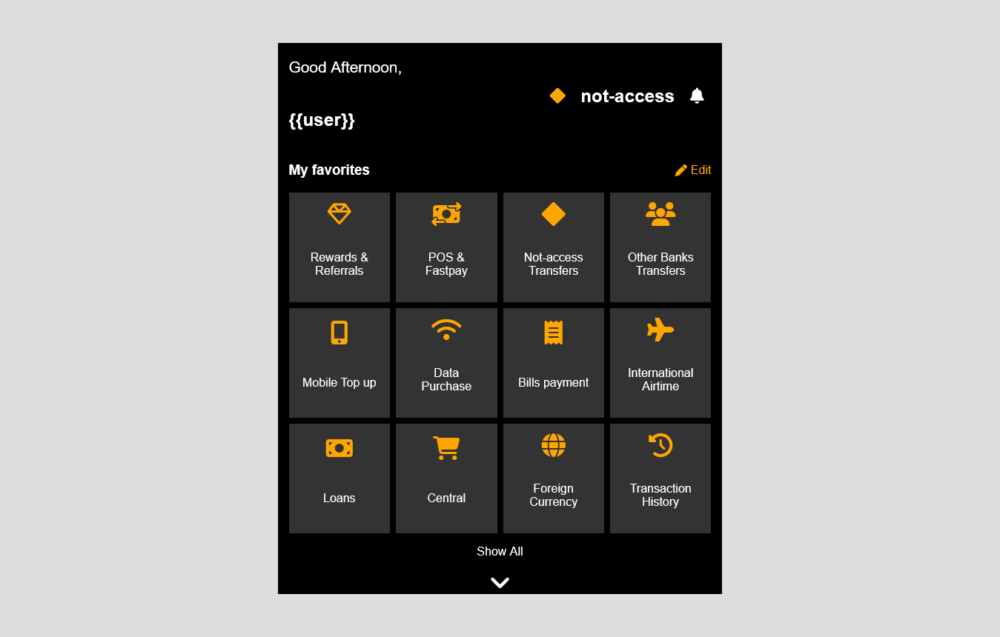

# Banking App Dashboard
A sample layout of a banking application

This design was created using HTML and CSS. A combination of CSS grid and Flexbox(mostly CSS grid) was used for teh arrangements of sections within the design. The design is responsive across 3 screen sizes.

### Screenshot

- Live Site URL: [Click here](https://kb-jr.github.io/Banking-App-Dashboard/)
